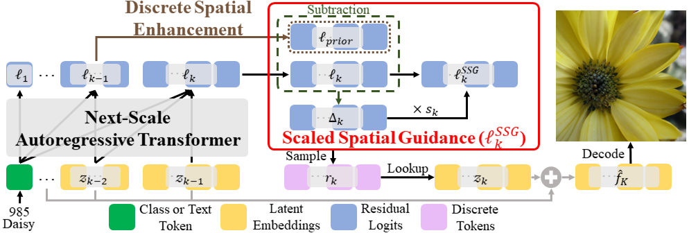
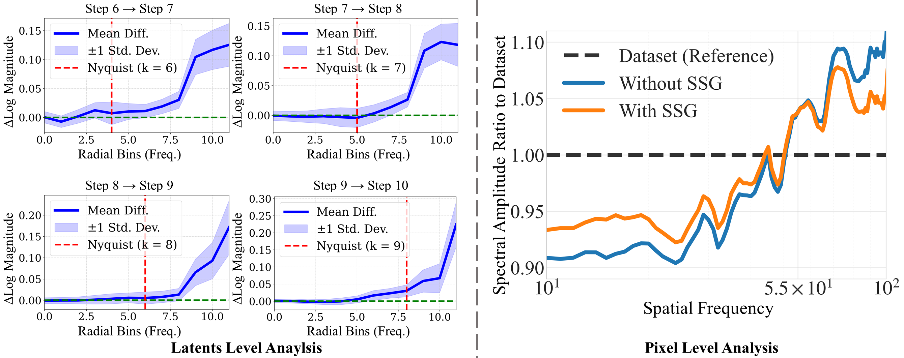

# SSG: Scaled Spatial Guidance for Multi-Scale Visual Autoregressive Generation

<div align="center">

[](https://openreview.net/forum?id=S6oLw7VixT)&nbsp;
[](https://arxiv.org/abs/2602.05534)&nbsp;
<!-- [](https://huggingface.co/FoundationVision/var)&nbsp; -->

</div>


<div>
  <p align="center" style="font-size: larger;">
    <strong>ICLR 2026</strong>
  </p>
</div>

<p align="center">

<p>
    
<br>

## 📣 Update Logs

- Code coming soon...⭐️

- Feb 3, 2026: Public repository launch

- Jan 26, 2026: 🎉 SSG has been accepted to ICLR 2026. 🎉

- Sep 24, 2025: Paper release

## 📝 Abstract

Visual autoregressive (VAR) models generate images through next-scale prediction, naturally achieving coarse-to-fine, fast, high-fidelity synthesis mirroring human perception. In practice, this hierarchy can drift at inference time, as limited capacity and accumulated error cause the model to deviate from its coarse-to-fine nature. We revisit this limitation from an information-theoretic perspective and deduce that ensuring each scale to contribute high-frequency content not explained by earlier scales mitigates the train–inference discrepancy. With this insight, we propose Scaled Spatial Guidance (SSG), a training-free, inference-time guidance that steers generation toward the intended hierarchy while maintaining global coherence. SSG emphasizes target high-frequency signals, defined as the semantic residual, isolated from a coarser prior. To obtain this prior, we leverage a principled frequency-domain procedure, Discrete Spatial Enhancement (DSE), devised to sharpen and better isolate the semantic residual through frequency-aware construction. SSG applies broadly across VAR models leveraging discrete visual tokens, regardless of tokenization design or conditioning modality. Experiments demonstrate SSG yields consistent gains in fidelity and diversity while preserving low latency, revealing untapped efficiency in coarse-to-fine image generation.

### 💡 Efficient, Training-Free Guidance for VAR-Structured Models:

<p align="center">

<p>


**Scaled Spatial Guidance (SSG)** 🎯: Unlike standard pre-sampling, which relies solely on the $k$-th step logits, SSG actively incorporates logits from the preceding scale. It calculates the difference between scales to identify and emphasize the specific information required to be generated at step $k$.

**Discrete Spatial Enhancement (DSE)** 🎯: A frequency-domain upscaling method designed to bridge the dimensional gap between scales. This technique minimizes information loss and artifacts when projecting the representation of the previous step to the resolution of the current step.


### 📊 SSG with DSE: Targeting Essential Details while Preserving Established Structural Integrity


<p align="center">

<p>


## 📖 Citation

If this project provided insights or was helpful to your research, please give us a star ⭐ and cite us using:

```
@misc{shin2026ssg,
      title={SSG: Scaled Spatial Guidance for Multi-Scale Visual Autoregressive Generation}, 
      author={Youngwoo Shin and Jiwan Hur and Junmo Kim},
      year={2026},
      eprint={2602.05534},
      archivePrefix={arXiv},
      primaryClass={cs.CV},
      url={https://arxiv.org/abs/2602.05534}, 
}
```

## License

This project is licensed under the MIT License - see the [LICENSE](./LICENSE) file for details.
